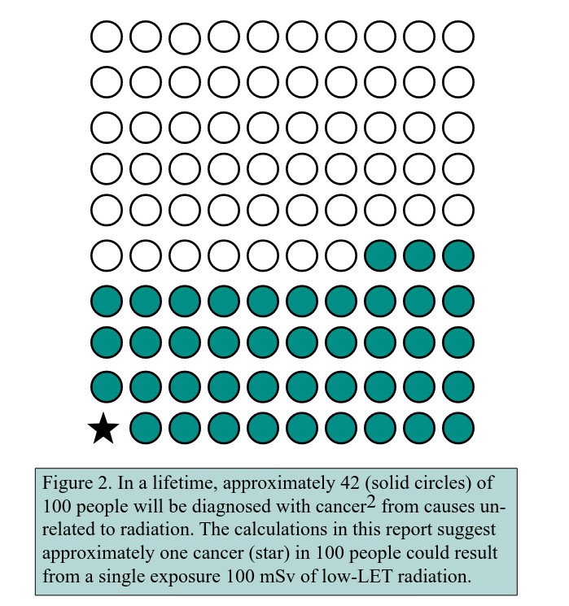

<label for="rate">Dose Rate</label>
<input type="text" value="0.7" class="form-control" id="rate">

<label for="rate-units">Units</label>
<select class="form-select" aria-label="Dose rate unit" id="rate-units">
  <option value="usv_hr">μSv/hr</option>
  <option value="mrem_hr">mrem/hr</option>
  <option value="mrem_hr">mR/hr</option>
  <option value="msv_hr">mSv/hr</option>
</select>

# Results

According to the linear no-threshold hypothesis, you can get that dose rate for:

<h2 class="text-center my-0 py-0" id="result">?</h2> 
before increasing your lifetime risk of getting cancer by 1% (from 42% to 43%).

That is about:

<h2 class="text-center my-0 py-0" id="multiplier">?</h2> 
the normal annual dose rate US citizens get from natural background radiation and medical treatments 
averaged over 1 year.

## More info

[BEIR VII](https://nap.nationalacademies.org/resource/11340/beir_vii_final.pdf)
says that if you get 100 mSv in one acute dose of radiation, you have an
additional 1 chance in 100 of getting cancer in your life, compared to a normal
lifetime risk of 42 in 100. In other words, it increases your chances of cancer
from 42% to 43%.

