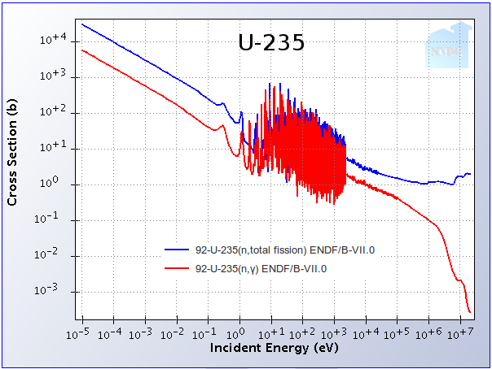
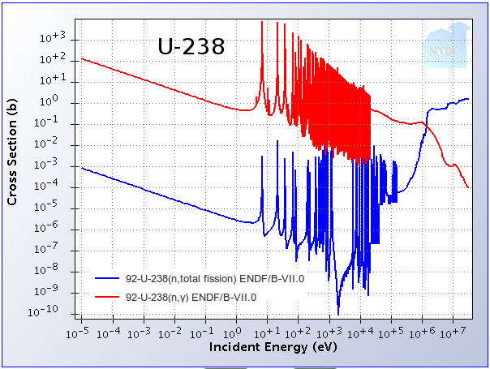
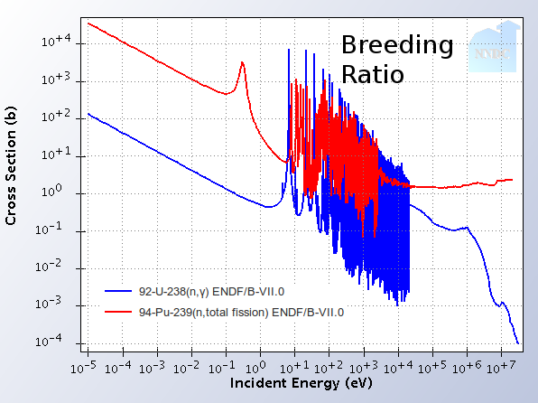
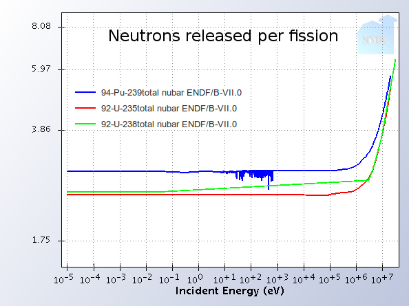

    
Fast reactors are nuclear reactors that are designed to maintain their neutrons at high
energies. Fast neutrons can unlock the energy in the dominant isotope of uranium (U238)
and thus extend known fuel resources by many orders of magnitude, enabling nuclear power
to achieve [long term sustainability]().

Whereas traditional reactors contain [moderators]() to slow down
neutrons after they're emitted, fast reactors keep their neutrons moving quickly.  An
average slow neutron moves around at about 2200 m/s while a fast neutron might be cruising
well above 9 million m/s, which is about 3% of the speed of light.

This page discusses the pros, cons, history, and physics of fast reactors

**Note**: The term *fast reactor* is a shortened version of *fast-neutron
reactor*.

&nbsp;

### On this page:
<ul>
<li><a href="#bigdeal">What&rsquo;s the big deal with fast reactors?</a></li>
<li><a href="#history">Some history</a></li>
<li><a href="#splittingmore">Splitting more U-238 than usual</a></li>
<li><a href="#havingmore">Having more neutrons flying around</a></li>
<li><a href="#howtomake">How to make a fast reactor</a></li>
<li><a href="#refs">See also</a></li>
</ul>

   
## Pros

* Fast reactors get more neutrons out of their primary fuel than traditional reactors,
  so many can be used to <a href="">breed new fuel</a>,
  vastly <b>enhancing the sustainability</b> of nuclear power.

* Fast reactors are capable of destroying the [longest-lived nuclear waste](), transforming it to waste that decays to harmlessness in **centuries
  rather than hundreds of millennia**.

* Fast reactors typically use liquid metal coolants rather than water. These have
  superior heat-transfer properties and allow natural circulation to remove the heat
  in even severe accident scenarios. The result: if something goes very wrong at the
  plant, and none of the operators are awake, AND none of the control rods work, the
  reactor can just **naturally shut itself down**. This comes with a con (see cons).

* Fast reactors can employ metallic fuel rather than oxides (thanks to chemical
  compatibility with the liquid metal coolant). Since metal has very high thermal
  conductivity, the reactor can shut itself down without surpassing temperature
  limits. This **enhances the safety** of these reactors significantly. 

## Cons

* While fast-neutron reactors are dramatically more resource efficient, they require 3x or more
  fissile atoms to start up initially. This is the main reason why slow-neutron reactors were
  developed first, and remains an economic challenge today.

* Bubbles in fast reactor coolant can cause the reactor to heat up rather than cool
  down, as in a traditional reactor. Higher heat makes more bubbles, which make more
  heat, and so on. This **positive feedback is scary** (but manageable, thanks to
  overpowering negative feedbacks).

* To keep the neutrons moving quickly, fast reactors **require exotic coolants** derived
  from heavy atoms. The most common coolant is liquid sodium, which is well known but
  highly reactive with air and water. Another is liquid lead-bismuth eutectic, which isn't
  the most pleasant material either. These bizarre materials require extra care and lower
  tolerance in many systems (such as piping), possibly **bringing costs up**.

* Time scales in fast reactor severe accidents are faster than those in slow-neutron reactors
  (because there are fewer *delayed neutrons* in fast reactors). Thus they can  **go
  through unpredicted changes faster** than traditional reactors. 

 

**Fast vs. thermal terminology** You'll often see reactors characterized as **fast**
or **thermal**. The term *thermal* in this context means that the majority of the
neutrons in the reactor core are in thermal equilibrium with their surrounding atoms. This is a
fancy way of saying that the neutrons have slowed down from their initially high speed to
energies as low as they're going to get. Since *thermal* also refers to heat in power
systems, we consider this nomenclature unnecessarily confusing and prefer to just use
fast-neutron reactors vs. slow-neutron reactors instead.

<h2 id="history">Some history</h2>

From the beginning of nuclear power, we knew the benefits of fast reactors. Uranium was
thought to be a very scarce resource, so breeder reactors were considered essential.
Enrico Fermi postulated the possibility of breeding, and this possibility was confirmed in
the EBR-1 reactor in Idaho (which, incidentally was also the first reactor to produce
electricity). Several other fast test reactors were built around the world (in France, the
UK, Japan, Russia, India, China) and today, the world has achieved around 400
reactor-years of operation with fast reactors. 

**Note:** We have an elaborate <a href="">reactor development history page</a> that covers this topic in general.

Uranium was found to be plentiful, and the commercial nuclear industry favored the
already-developed and operating slow-neutron reactors. Also, <a href="">recycling nuclear fuel</a> (as is often but not always called for in fast reactor fuel
cycles) brings up <a href="">proliferation concerns</a>
that inspired the Jimmy Carter administration to cancel a large US effort to develop a
fast-reactor system. Nowadays, with talk of expanding the share of nuclear power in the
electricity-producing world, debate about the remaining amount of uranium on earth has
resurfaced. Why switch from coal to uranium if we might run out in a few centuries anyway?
Also, one of the only ways to really destroy nuclear waste is to burn it in fast reactors.
So, by providing good responses to the sustainability and the waste toxicity, fast
reactors have maintained the interest of much of the forward-looking nuclear crowd. 

<h2 id="details">Technical Details</h2>
It might be wise to go read <a href="">our moderation
page</a> for a second and come back when you understand that neutrons emerge from
fission reactions at high speeds and that we typically like to slow them down to thermal
energies in order to increase their chances of continuing the chain reaction. This is what
is done in most reactors.  

Splitting atoms is not the only thing neutrons do. In nuclides such as Uranium-238,
slow neutrons are readily absorbed without causing a fission -- resulting in what we
call a capture. The probability for capture also increases dramatically at low
energies. We have measured through experiments that the chances that a neutron will cause
a capture rather than a fission in Uranium-238 are high at low energies and become
smaller at faster energies. Take a look at these two graphs showing the probability
(called the cross-section in nuclear lingo) of capture and the probability of fission as a
function of neutron energy for U-235 and U-238. By the way, the units of energy used here
are electron-volts (eV), where 1 eV is the energy that an electron would gain in an
electric field with 1 Volt.

<h2 id="splittingmore">Fast reactors split more atoms of U-238 than usual</h2>
Depending on the enrichment, our fuel&rsquo;s properties will be a mixture of these
two plots. In order to sustain a chain reaction, the number of neutrons produced from
fissions needs to be higher than the number of neutrons lost to capture (and a few
other loss mechanisms like leakage out of the reactor). As you can see, if all our
neutrons had more than 106 eV, U-238 would be nearly as good a fuel as
U-235. In reality, it&rsquo;s very difficult to keep the neutrons moving that quickly
so fast reactors still need a bit of enriched uranium to operate, but U-238 is
fissioned to much more of a degree than in slow-neutron reactors. As an added bonus, many
of the very long-lived nuclides larger than Uranium (Neptunium, Plutonium, Americium,
Curium, etc.) have the same trend, and fast reactors can split and destroy these
actinides as fuel rather than let them accumulate as in slow-neutron reactors. This makes
the nuclear waste coming out of fast reactors decay to natural radiation levels much
faster than traditional nuclear waste. 

<h2 id="havingmore">Fast reactors have high breeding ratios and more neutrons going around</h2>

The breeding ratio is a measure of how much new fissile fuel a reactor is capable of
producing as it runs. It is the ratio of the number of fissile atoms created with the
number of fissions occurring. 

Fast reactors using uranium fuel inherently create more fissile atoms per fission that
uranium-fueled slow-neutron reactors. The reason can be seen in the image to the right labeled
&quot;breeding ratio&quot;. In slow-neutron reactors, Pu239 fissions as soon as it is created
because the Pu239 fission rate is so much higher than the U238 absorption rate (which is
what creates fissile material). Conversely, fast reactors have U238 absorption rates that
are comparable to Pu239 fission rates. Thus, the fissile material can be replenished as it
burns. This also explains why initial enrichment of fast-neutron reactors has to be higher than
comparable slow-neutron reactors. 

The number of neutrons per fission changes in fast reactors as well. When atoms
fission, they release a few neutrons that continue a chain reaction. When a faster neutron
splits a Uranium atom, odds are that more neutrons will come out than if a slow neutron
hit it. This effect means that fast reactors have extra neutrons around that aren&rsquo;t
necessary for maintaining the chain reaction. Additionally, since more U-238 is directly
fissioning, there are neutrons being produced from non-fissile  material. These two
effects increase the breeding ratio even further. It can be larger than 1 in fast
reactors. This means that the bonus neutrons can be used to <a href="">breed new fuel</a> in <i>fast breeder reactors</i>. The big picture effect is that
U238 is usable as fuel instead of just U235. There is over 100x more U238 in nature than
U235, so the time that 200 years of uranium can last humanity turns into 20,000.

There are also significantly more free neutrons in fast reactors. Since the probability of
fission is lower for faster energies for every actinide, the neutron density is higher in
fast reactors than it is in most reactors of the same power (since power is
effectively the neutron density multiplied by the fission probability). Structural
materials inside fast reactors thus undergo higher radiation damage rates than those in
slow-neutron reactors. 

<h2 id="howtomake">How do we make a reactor fast or slow?</h2>
Nuclear reactors need to cool fuel as they undergoes the fission chain reaction.
Water is the standard coolant of other power plants for various reasons (it plays well
with steam turbines, is clean, is plentiful, has decent thermal properties, etc.), so
it was an obvious candidate for nuclear reactors. Luckily, it doesn&rsquo;t eat up too
many neutrons through capture, so it turned out to be a feasible choice. Water
contains lots of hydrogen atoms, with mass of 1 atomic mass unit. Being the same
weight as neutrons, conservation of momentum and energy tell us that a neutron
striking a hydrogen atom can slow down all the way from super fast to zero in one
collision (imagine a billiard ball striking a stationary one), so water coolant is
very good at slowing fast neutrons down to slower (thermal) energies. If you want to keep your
neutrons moving quickly, you don&rsquo;t want any small atoms around, so you choose a
heavier coolant, like sodium (imagine a billiard ball striking a bowling ball). So to
make a fast reactor, just take all the small atoms out. Some fast reactors use oxide
fuels, but those made with metallic fuel are even faster, since oxygen is a fairly
light atom.

<h1>Why do fast reactors use hexagonal assemblies?</h1>
Ok, this isn&rsquo;t really a commonly asked question in public, but whatever. Of all
the geometric shapes in the world, hexagons can be packed closest together, in an
arrangement known as <a
href="https://en.wikipedia.org/wiki/Sphere_packing#Circle_packing">hexagonal close-packing
[wikipedia]</a>. In order to get nuclear fuel as close together as possible, to make the
chain reaction easy, hexagons are the obvious choice. So the real question is why are
traditional reactor assemblies square? Since they require moderation, designers don&rsquo;t
want fuel as close as possible to itself. The extra room is specifically to be
filled with moderator, which is usually water. 

Another good reason to use hexagons is that fast reactors can become more reactive when
fuel is pushed closer together. To minimize the possibility of this, we like to get it as
close together to begin with.  

<!--

<h1>What is our operating experience with fast reactors?</h1>

The first nuclear reactor that generated electricity was a fast breeder reactor. 

-->

<h2 id="refs">See Also</h2>
<ul> 
<li>Our <a href="">breeding and recycling page</a></li>
<li><a href="https://en.wikipedia.org/wiki/Fast_neutron_reactor">Fast neutron reactor [wikipedia]</a> - Wikipedia has a decent page on these guys, with a list of all that have operated. </li>
<li><a href="http://www.nndc.bnl.gov/sigma/index.jsp">The National Nuclear Data Center</a>, from where all the cross-section data are taken (Happy, <a href="http://atomicinsights.blogspot.com/2008/05/imagining-scale-of-energy-storage.html">Rod</a>?)</li>

</ul>

 Questions? Comments? Send us <a href="contact.html">a note</a>.

## References

Here are some good overview references for continued learning

* [The Fast Reactor Database, IAEA-TECDOC-1531](http://www-pub.iaea.org/books/IAEABooks/7581/Fast-Reactor-Database-2006-Update)
* [Status of Fast Reactor Research and Technology Development, IAEA TECDOC 1691](http://www-pub.iaea.org/books/IAEABooks/8667/Status-of-Fast-Reactor-Research-and-Technology-Development)
* [Breeder Reactors](https://www.osti.gov/biblio/1135678) -- A 1971 booklet summarizing breeder reactors.
* [Advanced Nuclear Reactors](https://babel.hathitrust.org/cgi/pt?id=coo.31924071415222&view=1up&seq=1) -- A 1975 summary of breeder development in the USA

## See Also

* [Moderation]()

     
      
