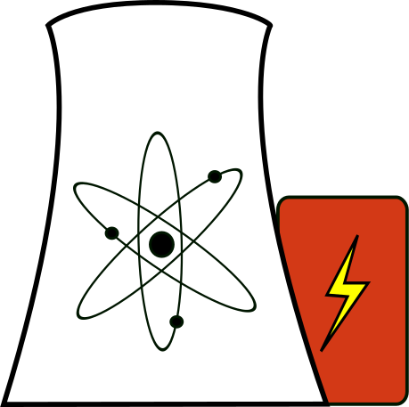

  

    
    <h1 class="display-3 fw-bold">What is Nuclear?</h1>
    <h3 class="fw-normal text-muted mb-3">Nuclear expertise for everyone</h3>
  

  <main>
    

      

        

          <a href="">
            

              <i class="fas fa-user-graduate"></i>
            

            <h3 class="fs-2 text-body-emphasis">Nuclear Essentials</h3>
            

              Start here to learn more about nuclear power's capabilities and limitations. You'll learn about different
              types of nuclear reactors, reprocessing, thorium, fission vs. fusion, and nuclear waste.
            

            <a href="" class="icon-link"> Start with the Essentials </a>
          </a>
        

        

          

            <i class="fas fa-book-open"></i>
            <svg class="bi" width="1em" height="1em">
              <use xlink:href="#people-circle"/>
            </svg>
          

          <h3 class="fs-2 text-body-emphasis">Nuclear Deep Dives</h3>
          
Sharpen up on nuclear power economics, the history of nuclear reactor development, and more

          <a href="" class="icon-link"> Read some early reactor development history </a>
        

        

          

            <i class="far fa-folder-open"></i>
          

          <h3 class="fs-2 text-body-emphasis">Reference</h3>
          

            We also feature large amounts of reference information such as
            <a href="">Calculations</a> and more.
          

          <a href="" class="icon-link"> See the Nuclear Reading List </a>
        

      

    

    

      <h2>Latest Updates</h2>

      

        

          
          
            
            
              
                

              
                

              
              

            
            

              <a href="{{ post.url }}" style="text-decoration: none;">
                

                  
                  

                    <h5 class="card-title">{{ post.title }}</h5>
                    
{{ post.description | truncatewords: 25 }}

                    <button class="border-0">
                      Read more
                    </button>
                  

                  

                    <small class="text-body-secondary">Posted on: {{ post.date | date: '%Y-%m-%d' }}</small>
                  

                

              </a>
            

            
              

              

            
          
        

        <!-- end carousel-inner -->
        <button class="carousel-control-prev" type="button" data-bs-target="#newsCarousel" data-bs-slide="prev">
          
          Previous
        </button>
        <button class="carousel-control-next" type="button" data-bs-target="#newsCarousel" data-bs-slide="next">
          
          Next
        </button>
      

    

    <a href="" class="btn btn-success m-1" role="button"
      ><i class="far fa-newspaper"></i> See all news</a
    >
  </main>

  

    

      <a href="" class="btn btn-success m-1" role="button">Next &#10095;</a>
    

  

  
  

<!-- end container -->
