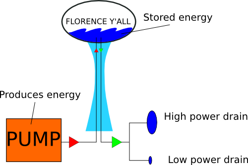

# Power and Energy
Here you&rsquo;ll learn the difference between power and energy, and some other terminology.

     

A classic analogy used to describe power and energy is based on water towers. Water in the tower is
energy and the flow of water out of the tower is power. Energy can be stored, like water. It can
also flow. When energy flows, it can do work like moving stuff or lighting a house. The speed at
which energy flows is called <b>power</b>. The same amount of energy can be released at high power
(which will occur quickly) or at low power (which will take more time).

Energy is measured in Joules. A ton of wood might have 18 billion Joules of energy stored in it.
Power is measured in Watts, which are just Joules per second. So if you burned that ton of wood in a
week, your furnace would be putting out 18 GJ/week, which converts to 29.7 thousand Watts. If you
burned it in a month, the furnace would be running at 6.8 thousand Watts. In the end, no matter how
quickly you did it, you still used 18 GJ of energy. By the way, the amount of energy required to
lift an apple 1 meter is about 1 Joule. 

# Power lingo in the electric industry
Rather than the standard units of Joules, electric companies bill by the kilowatt-hour, as you can
see by looking at your most recent utility bill. This is just another measure of energy, akin to the
Joule. 1 kW-hr is the amount of energy used if it is pulled at 1000 Watts for 1 hour. If you convert
hours to seconds, you&rsquo;ll find that this is equivalent to 3.6 million Joules. 

# Burnup
There is a specific amount of energy in each nuclear fuel atom that can be released in a nuclear
reactor. Thus, any kilogram of the same kind of Uranium has about the same amount of energy in it.
In the nuclear industry, we use the term <b>burnup</b> to describe how much of this energy has been
used up. It&rsquo;s often discussed in units of Gigawatt-days (units of energy) per metric tonne
(units of mass), or GWd/MT. The maximum theoretical burnup of Uranium is about 940 GWd/MT, with
typical reactors reaching about 45 GWd/MT and fast reactors pushing 200GWd/MT. 

# Nuclear power vs. nuclear energy?
When discussing electricity provided by nuclear reactors, the terms &quot;nuclear power&quot; and
&quot;nuclear energy&quot; are used completely interchangeably. The preferred term is nuclear
energy, as nuclear power brings to mind things like the USSR, the USA, and bombs. 

# See Also

<ol>
<li>
<a href="https://en.wikipedia.org/wiki/Burnup">Burnup [wikipedia.org]</a></li>
<li><a href="https://en.wikipedia.org/wiki/Power_%28physics%29">Power [wikipedia.org]</a></li>
<li><a href="https://en.wikipedia.org/wiki/Energy">Energy [wikipedia.org]</a></li>
<li><a href="https://en.wikipedia.org/wiki/Joule">Joule [wikipedia.org]</a></li>

</ol>

