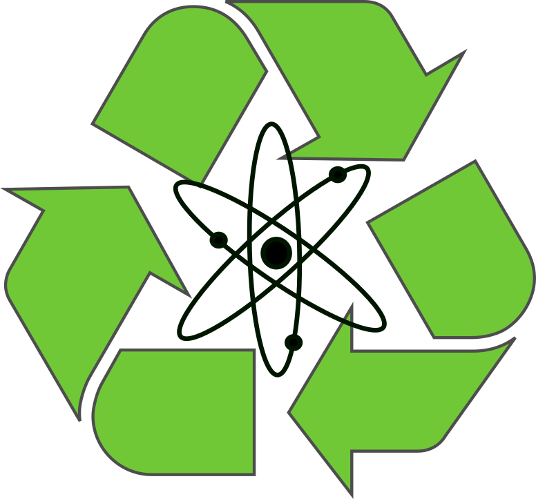
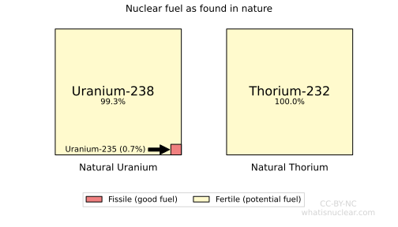
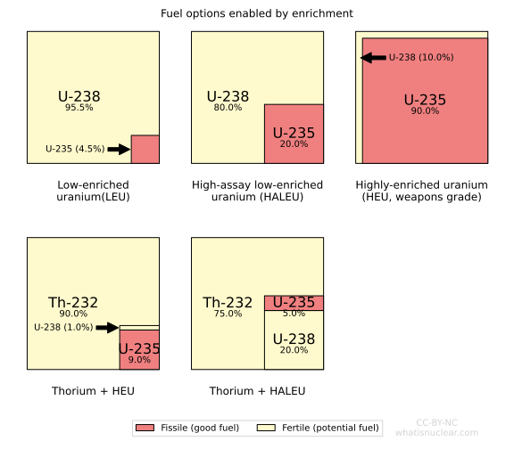
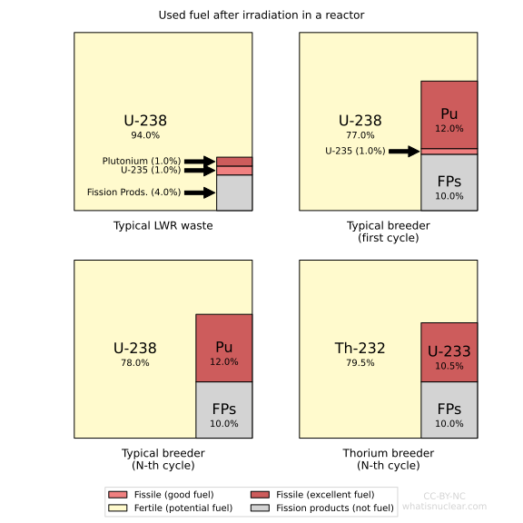
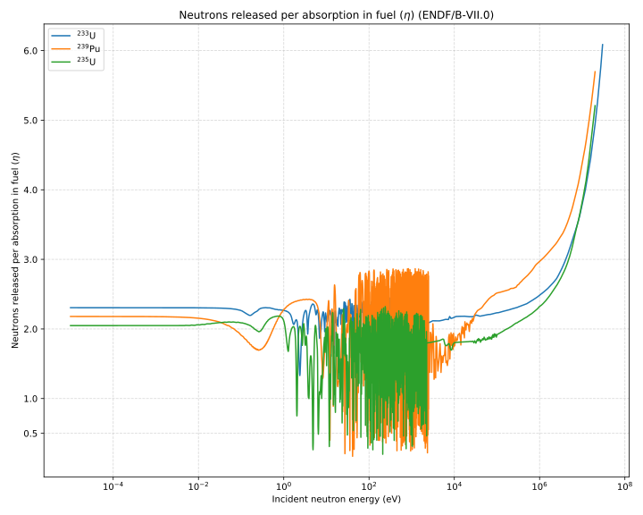
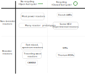

Nuclear waste is recyclable. Once reactor fuel (uranium or thorium) is used in a
reactor, it can be treated and put into another reactor as fuel. 

Nuclear fuel used today almost all starts out as natural uranium, which has two
<a href="">isotopes</a>
in it, Uranium-238 and Uranium-235.  The minority isotope (U-235) can
sustain a nuclear chain reaction. We call such isotopes <em>fissile</em>. The 
other isotopes (U-238 and Thorium-232) are <em>fertile</em>, meaning they could
be changed into fissile nuclides in a reactor, but cannot sustain a chain
reaction on their own. Natural fuel forms are shown below.

Because it contains some fissile material naturally, it is possible to build a
few kinds of nuclear reactors directly fueled with natural uranium. The first
man-made nuclear reactors used natural uranium and ultra-pure graphite. Canada's
CANDU reactors use natural uranium with heavy water. But many new benefits arise
if you mechanically concentrate the U-235 to a higher fraction. This difficult
process is done in <em>uranium enrichment plants</em>. Most power reactors today
are fueled with low-enriched uranium. Note that as uranium is enriched more,
larger piles of depleted uranium (mostly U-238) are left over as tails. The 
following figure shows fuel forms enabled by enrichment.

Once the neutron chain reaction begins in a reactor, a number of key things happen
to the atoms:

* Most (**but not all**) of the fissile atoms get split by the neutrons into smaller atoms called
  *fission products*, releasing the nuclear energy as heat. As these fission
  products build up, they eventually absorb lots of neutrons themselves, 
  requiring the reactor to refuel with new fissile atoms.
* Many of the fertile atoms absorb neutrons too, after which:
    * Some directly fission into fission products as above
    * Some go through a series of nuclear reactions to become fissile nuclides
      * Some of these newly-generated fissile atoms get fissioned right away
      * Others of the newly-generated fissile atoms **remain after the chain reaction stops**

When a nucleus has too many neutrons to remain stable, it can undergo a nuclear
transformation called beta-decay breaking a neutron into a proton and an
electron. The electron (called a beta-particle because it originated in the
nucleus) flies off into nature. 

When U-238 absorbs a neutron in a reactor, it becomes U-239, the isotope with
one extra neutron than U-238. This unstable nuclide beta-decays quickly into
Np-239. Then, the Np-239 beta-decays again to become Pu-239, a fissile isotope
that can power nuclear reactors. A analogous process happens when Thorium-232
absorbs a neutron to become fissile Uranium-233.

The fissile atoms left over in the used fuel (red in the figure below) are what
can be recycled. How many fissile atoms are in the used fuel depends strongly on
the kind of reactor used. Typical reactors leave just a little bit, but special
reactors called *breeder reactors* can actually leave more fissile material than
they started with! More on that later.

All reactors have some fissile material left over when the fuel is discharged. 
If you pull this material out and put it into a *reprocessing plant* you can 
separate out the constituents and then remix them as desired for your fuel cycle.
Recycling has several use cases:

* **Sustainability** —­ You can separate the fissile material from the neutron-absorbing fission products
  and refabricate it into new fuel for another reactor, thereby improving your overall
  fuel efficiency. This effectively increases the miles-per-gallon of your reactor. 
* **Radiotoxicity reduction** — If you recycle your fuel in [fast-neutron reactors](), 
  you can transmute the waste nuclides from ones with 10,000-year half-lives to ones with 200-year half-lives, 
  reducing the long-term radiotoxicity of your waste. (See more at the [waste page]()).
* **Waste Design** — You can change the physical form of your waste into something extra
  compatible with its ultimate repository, e.g. by vitrifying it, grouting it, and so on.
* **Military weapons** — The original reprocessing was done to obtain weapons-grade plutonium
  from natural uranium fueled reactors [at Hanford](). Other countries
  have used reprocessing of special weapons-production reactor fuel for similar purposes.
  Note that this is less of a concern for power reactors because the isotopic composition
  of the plutonium that remains is not ideal for nuclear weapons.

## Breeder Reactors and Recycling

Breeder reactors are nuclear reactors configured to generate more fissile fuel
from fertile potential fuel during operation than they consume.  The net gain in
converting fertile material into fissile material implies that **all** of the
fertile natural resources shown in the first image of this page can be utilized
in reactors. Contrast this with non-breeder reactors, which can effectively only
use the tiny red box's worth. 

The sustainability implications of breeder reactors are astounding. If you use
breeder reactors, nuclear fuel resources can [last for billions of years]().

The trick to making a breeder reactor comes down to knowing something about nuclear
physics. The key facts are:

* When fast neutrons cause a fission, more secondary neutrons are released than
  if a slow neutron causes fission
* The likelihood of any nuclide capturing a neutron decreases rapidly
  when the neutron is moving really fast (faster than 1 MeV), but the likelihood
  of a fast neutron causing fission stays reasonably high.
* U-233 emits more neutrons per fission when split by a slow neutron than 
  U-235 or Pu-239, and has a better capture-to-fission ratio.

The net result of these facts can be summarized with a plot of eta (η), which
is the number of neutrons released in fission per neutron absorbed in fuel. When
eta is sufficiently higher than 2.0, you can make a breeder reactor. Thus, the options are:

* Make a thorium/U-233 breeder with slow neutrons (left-hand side), or
* Make a uranium/plutonium breeder with fast neutrons (right-hand side) 

Both of these configurations have sufficient excess neutrons to allow you to pack in lots of 
fertile material while still sustaining a nuclear chain reaction. The more fertile
material you pack in, the more neutrons get invested in it, generating fissile material.

<strong>Note:</strong> 
You can read more about [fast reactors]() and [thorium
reactors]().  Note that all thorium are necessarily breeder
reactors, since natural thorium has no fissile component.

Recycling and breeding are often thought of together, but they are on separate axes. 
Countries like France recycle fuel from non-breeder reactors. Most long-term 
sustainable nuclear plans involve using breeder reactors plus recycling. It is also
possible to use a breeder reactor without recycling at all using advanced deep-burn fuels.

## Nuclear Fuel cycles
A nuclear fuel cycle is the path that nuclear fuel (Uranium, Thorium, Plutonium, etc.) takes as it
is used to generate power in a nuclear reactor. Our <a href="">fuel cycle
page</a> has more info. They describe where the material comes from and where it ends up. Different
fuel cycles range from very simple to fairly complicated. We describe several of these below. 

### Once Through Cycle

<strong>Figure 1.</strong> A once-through fuel cycle. Put your mouse over each image for more info. 

The simplest fuel cycle is the once-through cycle. It is the de-facto standard in most operating
nuclear power plants, with a few exceptions in Europe and Asia. Uranium is mined, enriched, used in
a reactor (where it becomes radioactive nuclear waste), and then stored until it is no longer
dangerously radioactive. While this cycle is cheap, there are two major problems with it. Firstly,
the waste is radioactive for hundreds of thousands of years. No one has been able to design a
repository that is convincingly capable of storing material for that long. Secondly, Uranium is not
the most abundant element on Earth, and in this kind of cycle, the global supply of cheap uranium
could run low within 200 years. So much for sustainability! There are some deep-burn once-through
cycles out there that have good sustainability properties though. 
<map name="oncemap" id="oncemap">
<!-- #$-:Image map file created by GIMP Image Map plug-in -->
<!-- #$-:GIMP Image Map plug-in by Maurits Rijk -->
<!-- #$-:Please do not edit lines starting with "#$" -->
<!-- #$VERSION:2.3 -->
<!-- #$AUTHOR:Nick Touran -->
<area shape="rect" coords="0,9,100,85" href="/img/fuelcycle_once_through.svg" alt="Natural uranium ore is extracted from the ground at the mine. The enrichment plant increases the concentration of U-235 in the natural uranium up to around 4 percent." title="Natural uranium ore is extracted from the ground at the mine. The enrichment plant increases the concentration of U-235 in the natural uranium up to around 4 percent."/>
<area shape="circle" coords="157,49,17" href="/img/fuelcycle_once_through.svg" alt="This is enriched Uranium, with about 4 percent U-235 and the rest U-238." title="This is enriched Uranium, with about 4 percent U-235 and the rest U-238."/>

<area shape="rect" coords="219,27,306,70"  href="/img/fuelcycle_once_through.svg" alt="This is a regular reactor, of which there are about 100 of in the USA. It is water cooled and requires enriched uranium." title="This is a regular reactor, of which there are about 100 of in the USA. It is water cooled and requires enriched uranium."/>

<area shape="rect" coords="350,1,398,95" href="/img/fuelcycle_once_through.svg" alt="When the reactor runs for a few years, the waste is made up of depleted uranium (with very little U-235 left), plutonium and other actinides, and the fission products." title="When the reactor runs for a few years, the waste is made up of depleted uranium (with very little U-235 left), plutonium and other actinides, and the fission products."/>

<area shape="rect" coords="452,11,499,85"  href="/img/fuelcycle_once_through.svg" alt="In a once through cycle, the waste goes straight into a waste repository, where it is supposed to stay for up to a million years." title="In a once through cycle, the waste goes straight into a waste repository, where it is supposed to stay for up to a million years."/>
</map>

<h3 id="closed">Closed Fuel Cycle</h3>

<strong>Figure 2.</strong> A closed fuel cycle. Here nuclear material is recycled. Put your mouse over each image for more info. 

Closing the fuel cycle involves recycling the nuclear waste as new fuel. Since the main component of
nuclear waste is Uranium-238 (which can be transmuted to Plutonium, especially with advanced breeder
reactors), we can get more energy out of the waste than in a once-through cycle <a
href="">(see factoid 2 to see how much)</a>. The recycling plant separates
the good stuff from the bad stuff. The bad stuff is mostly fission products, the atoms that a
Uranium atom becomes after it splits in the fission process. These fission products mostly decay to
safe levels within 300-500 years, which is significantly shorter than standard nuclear waste. So, by
closing the fuel cycle with standard reactors, we address the issue of nuclear waste identified in
the once-through cycle. In this case, nuclear waste is a tractable problem. But most of the
reactivity is coming from the mine, since standard reactors burn most of the fissile nuclide, U-235.
Also, the reprocessing technology is expensive and separates out pure Plutonium, which could
possibly be stolen, bringing a rogue entity closer to having a nuclear weapon. For these reasons,
the USA does not currently recycle. There are ways to solve these issues. 

<map name="recyclemap" id="recyclemap">
<!-- #$-:Image map file created by GIMP Image Map plug-in -->
<!-- #$-:GIMP Image Map plug-in by Maurits Rijk -->
<!-- #$-:Please do not edit lines starting with "#$" -->
<!-- #$VERSION:2.3 -->
<!-- #$AUTHOR:Nick Touran -->
<area shape="rect" coords="1,15,121,105" href="/img/fuelcycle_recycle.svg" alt="Natural uranium ore is extracted from the ground at the mine. The enrichment plant increases the concentration of U-235 in the natural uranium up to around 4 percent." title="Natural uranium ore is extracted from the ground at the mine. The enrichment plant increases the concentration of U-235 in the natural uranium up to around 4 percent."/>

<area shape="rect" coords="168,41,212,80"  href="/img/fuelcycle_recycle.svg" alt="This is enriched Uranium, with about 4 percent U-235 and the rest U-238." title="This is enriched Uranium, with about 4 percent U-235 and the rest U-238." />

<area shape="rect" coords="258,33,372,88"  href="/img/fuelcycle_recycle.svg" alt="This is a regular reactor, of which there are about 100 of in the USA. It is water cooled and requires enriched uranium." title="This is a regular reactor, of which there are about 100 of in the USA. It is water cooled and requires enriched uranium."/>

<area shape="rect" coords="423,1,483,117"  href="/img/fuelcycle_recycle.svg" alt="When the reactor runs for a few years, the waste is made up of depleted uranium (with very little U-235 left), plutonium and other actinides, and the fission products." title="When the reactor runs for a few years, the waste is made up of depleted uranium (with very little U-235 left), plutonium and other actinides, and the fission products." />

<area shape="rect" coords="266,125,365,181" onmouseover="domTT_activate(this, event, 'width', '200', 'caption', 'New Fuel', 'content', 'The depleted uranium and the plutonium from the reprocessing plant can be put back into the reactor in place of enriched uranium because the plutonium splits readily, just like U-235.','trail', true);" href="/img/fuelcycle_recycle.svg" title="The depleted uranium and the plutonium from the reprocessing plant can be put back into the reactor in place of enriched uranium because the plutonium splits readily, just like U-235." alt="The depleted uranium and the plutonium from the reprocessing plant can be put back into the reactor in place of enriched uranium because the plutonium splits readily, just like U-235."/>

<area shape="rect" coords="410,173,499,225" onmouseover="domTT_activate(this, event, 'width', '200', 'caption', 'Recycling Plant', 'content', 'The recycling plant chemically separates the nuclear waste into depleted uranium, plutonium, and the fission products.','trail', true);" href="/img/fuelcycle_recycle.svg" alt="The recycling plant chemically separates the nuclear waste into depleted uranium, plutonium, and the fission products." title="The recycling plant chemically separates the nuclear waste into depleted uranium, plutonium, and the fission products."/>

<area shape="rect" coords="292,228,323,254" href="/img/fuelcycle_recycle.svg" alt="These are the atoms that uranium or plutonium split into, so they are about half as large as Uranium. They are often radioactive, but decay to stability much faster than standard nuclear waste, which includes heavy actinides like Plutonium, Americium, and Neptunium. " title="These are the atoms that uranium or plutonium split into, so they are about half as large as Uranium. They are often radioactive, but decay to stability much faster than standard nuclear waste, which includes heavy actinides like Plutonium, Americium, and Neptunium. "/>

<area shape="rect" coords="149,192,212,276"  href="/img/fuelcycle_recycle.svg" alt="Since the fission products decay to stability on the order of 300 years, the repository does not need to last for a million years, as it does with standard nuclear waste." title="Since the fission products decay to stability on the order of 300 years, the repository does not need to last for a million years, as it does with standard nuclear waste." />
</map>

<h3 id="breeder">Breeder Fuel Cycle</h3>

<strong>Figure 3.</strong> A closed fuel cycle with breeding. More fissile material is created from breeding than is used to make energy. (Put your mouse over each image for more info.) 

<a href="">Breeder reactors</a> can create as much or more fissile
material (atoms that readily split) than they use. These special reactors are designed to have extra
neutrons flying around, so that some can convert U-238 to Pu-239 (see above) and the others can run
the reactor. Often, these special reactors are deemed &quot;fast&quot; reactors because the neutrons
are moving through the reactor at higher speeds, on average. In a full breeder fuel cycle, we get
the maximum use of the Uranium resources on Earth, and what we already know exists can last tens of
thousands of years. The cycle has cost and proliferation concerns associated with any closed cycle.
Additionally, we have significantly less operational experience with breeder reactors, so we would
need to train builders and operators for such a machine. Using a Thorium cycle instead of a
Uranium-Plutonium cycle may allow breeding in less exotic reactors. Using this kind of fuel cycle,
nuclear power can <a href="">truly be considered sustainable</a>.

Questions? <a href="contact.html">Send them in!</a>

<map name="breedermap" id="breedermap">
<!-- #$-:Image map file created by GIMP Image Map plug-in -->
<!-- #$-:GIMP Image Map plug-in by Maurits Rijk -->
<!-- #$-:Please do not edit lines starting with "#$" -->
<!-- #$VERSION:2.3 -->
<!-- #$AUTHOR:Nick Touran -->
<area shape="rect" coords="1,7,78,65" href="/img/fuelcycle_breeder.svg" alt="Natural uranium ore is extracted from the ground at the mine. The enrichment plant increases the concentration of U-235 in the natural uranium up to around 4 percent." title="Natural uranium ore is extracted from the ground at the mine. The enrichment plant increases the concentration of U-235 in the natural uranium up to around 4 percent."/>

<area shape="circle" coords="128,38,13"  href="/img/fuelcycle_breeder.svg" title="This is enriched Uranium, with about 4 percent U-235 and the rest U-238." alt="This is enriched Uranium, with about 4 percent U-235 and the rest U-238." />

<area shape="rect" coords="173,18,246,52"  href="/img/fuelcycle_breeder.svg" alt="Breeder reactors make more fissile material than they consume. They have been built before, but are not in common use." title="Breeder reactors make more fissile material than they consume. They have been built before, but are not in common use."/>

<area shape="rect" coords="282,1,320,75" href="/img/fuelcycle_breeder.svg" alt="Waste from breeder reactors will have the same basic components as standard nuclear waste, but it will have significantly more fissile material in it (Plutonium or U-233 from a Thorium cycle)" title="Waste from breeder reactors will have the same basic components as standard nuclear waste, but it will have significantly more fissile material in it (Plutonium or U-233 from a Thorium cycle)" />

<area shape="rect" coords="174,80,241,119"  href="/img/fuelcycle_breeder.svg" alt="Some of the breeders waste can be used to refuel the breeder for another cycle." title="Some of the breeders waste can be used to refuel the breeder for another cycle."/>

<area shape="rect" coords="269,112,330,148"  href="/img/fuelcycle_breeder.svg" alt="The recycling plant chemically separates the nuclear waste into depleted uranium, plutonium, and the fission products." title="The recycling plant chemically separates the nuclear waste into depleted uranium, plutonium, and the fission products."/>

<area shape="rect" coords="373,111,437,150"  href="/img/fuelcycle_breeder.svg" alt="Since the breeder makes extra fissile material, it can fuel several other reactors as well as itself." title="Since the breeder makes extra fissile material, it can fuel several other reactors as well as itself."/>

<area shape="rect" coords="101,126,141,180" alt="Since the fission products decay to stability on the order of 300 years, the repository does not need to last for a million years, as it does with standard nuclear waste." title="Since the fission products decay to stability on the order of 300 years, the repository does not need to last for a million years, as it does with standard nuclear waste." href="/img/fuelcycle_breeder.svg" />

<area shape="circle" coords="203,157,9"  href="/img/fuelcycle_breeder.svg" alt="These are the atoms that uranium or plutonium split into, so they are about half as large as Uranium. They are often radioactive, but decay to stability much faster than standard nuclear waste, which includes heavy actinides like Plutonium, Americium, and Neptunium." title="These are the atoms that uranium or plutonium split into, so they are about half as large as Uranium. They are often radioactive, but decay to stability much faster than standard nuclear waste, which includes heavy actinides like Plutonium, Americium, and Neptunium."/>

<area shape="rect" coords="480,60,560,202" href="/img/fuelcycle_breeder.svg" alt="These can be standard water reactors or more breeder reactors." title="These can be standard water reactors or more breeder reactors." />

<area shape="rect" coords="610,93,649,169" href="/img/fuelcycle_breeder.svg" alt="The waste from these plants can also be recycled in a closed fuel cycle." title="The waste from these plants can also be recycled in a closed fuel cycle."/>
</map>

## Additional Reading
* <a href="http://www-pub.iaea.org/books/IAEABooks/7112/Implications-of-Partitioning-and-Transmutation-in-Radioactive-Waste-Management">Implications of Partitioning and Transmutation in Radioactive Waste Management, IAEA Technical Reports Series 435</a>
* [Bunn, The Economics of Reprocessing Versus Direct Disposal of Spent Nuclear
  Fuel](http://nrs.harvard.edu/urn-3:HUL.InstRepos:30209100) -- A report suggesting that
  reprocessing only becomes economical after fuel costs exceed $360/kg
* Our <a href="">fuel cycle page</a>
* <a href="#enrichment">Our explanation of enrichment</a>
* <a href="">Our nuclear waste page</a>
* <a href="">Our Breeder reactors page</a>
* <a href="https://en.wikipedia.org/wiki/Yucca_mountain">Yucca Mountain (Wikipedia)</a>

