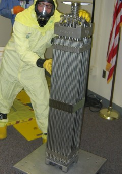

# What about the waste?
You probably already know that nuclear reactors make nuclear waste. But what is it? Is it wise to generate 
energy if this waste is produced? This page answers these questions, including how nuclear waste is produced, 
what its nature is, what the safe storage/treatment options are, and how it compares to waste generated by 
other energy sources. 

## TL;DR (quick summary)
Nukes produce unbelievably little waste compared to other energy sources. Although it is toxic, we 
know safe ways to store it until it has naturally decayed to harmlessness. In the face of larger problems
like fossil-fueled air pollution and climate change, the relatively minor issue of nuclear waste disposal should not dissuade 
us from deploying reactors to power substantial fraction of the planet. Also, advanced reactors offer 
ways to reduce waste further, and some can even recycle it (though this is not cheap).

## What is Nuclear Waste?
Nuclear waste is the material that nuclear fuel becomes after it is used in a [reactor]({{ site.baseurl }}). 
From the outside, it looks exactly like the fuel that was loaded into the reactor &mdash; typically assemblies of metal rods 
enclosing fuel pellets. But since nuclear reactions have occurred, the contents aren&rsquo;t quite the same.

Nuclear energy is released when a nuclear fuel nucleus snaps into two. The key component of nuclear 
waste is the leftover smaller nuclei, known as fission products.

<strong>Figure 1. </strong>The fission process of a single atomic nucleus. The large majority of the energy is 
released instantaneously, but the rest of it comes out from the fission products over the years. 
That slowly released energy is what makes nuclear waste a hazard.

You never know which two fission products you're going to get for a given fission, but you always get 
the same average composition as billions upon billions of atoms split. You basically get a huge 
variety of stuff, shown below.

<strong>Figure 2. </strong>The fission products include radioactive <a href="">isotopes</a> 
of the elements shown here. You can see that they span a wide variety of elements including alkali metals, 
transition metals, halogens, and even noble gases. The complex chemistry associated with this diversity 
is a key challenge in nuclear waste management. (Color is proportional to the log of the instantaneous yield.)

The waste, sometimes called *used fuel*, is dangerously [radioactive](), and remains so 
for thousands of years. When it first comes out of the reactor, it is so toxic that if you stood close to it while 
it was unshielded, you would receive a lethal radioactive dose within a few seconds and would die of 
[acute radiation sickness [wikipedia]](https://en.wikipedia.org/wiki/Radiation_poisoning) within a few days. 
Hence all the worry about it.

## What do we currently do with our nuclear waste?
In practice, the spent fuel is never unshielded. It is kept underwater (water is an excellent
shield) for a few years until the radiation decays to levels that can be shielded by concrete in
large storage casks (see [video of storage casks](https://www.youtube.com/watch?v=EUvvIzH2W6g)).
Options for final disposal include deep geologic storage and recycling. (The sun would consume it
nicely if we could get into space, but since rockets are so unreliable, we can't afford to risk
atmospheric dispersal on lift-off.)

Finland is the world leader in long-term nuclear waste disposal. Their Onkalo deep geologic repository is [expected
to the be the world's first](https://psmag.com/ideas/the-hiding-place-inside-the-worlds-first-long-term-storage-facility-for-highly-radioactive-nuclear-waste). 

## How much nuclear waste does nuclear energy create?
If all the electricity use of the USA was distributed evenly among its population, and all of it came 
from nuclear power, then the amount of nuclear waste each person would generate per year would be 
**39.5 grams**. That's the weight of seven U. S. quarters of waste, per year! A detailed description 
of this result can be found [here](/assets/waste_per_person.pdf). If we got all our electricity 
from coal and natural gas, expect to have over 10,000 kilograms of CO2/yr attributed to 
each person, not to mention other poisonous emissions directly to the biosphere 
(based on EIA [emissions data](https://www.eia.gov/environment/emissions/ghg_report/ghg_carbon.php)). 
         
If you want raw numbers: in 2018, there were just over 80,000 metric tonnes of
high-level waste in the USA.  Between 1971 and 2018, nuclear reactors in the
USA generated 17.3 GW-years of electricity to make this waste.  For another
perspective, each average US home using 10,000 kWh/year of nuclear electricity
would generate 5 grams of waste per year. This is astoundingly low, again,
thanks to the near magical energy density of the atom.

    

 

## Composition of nuclear waste

Spent nuclear fuel composition varies depending on what was put into the reactor, how long the reactor 
operated, and how long the waste has been sitting out of the reactor. A typical US reactor's waste 
composition is laid out in **table 1**. Notice that most of the Uranium is still in the 
fuel when it leaves the reactor, even though its enrichment has fallen significantly. This Uranium 
can be used in [advanced fast reactors]() as fuel and is a 
valuable energy source. The **minor actinides**, which include Neptunium, Americium, 
and Curium, are very long-lived nuclides that cause serious concern when it comes to storing them 
for more than 100,000 years. Fortunately, these are fissionable in fast reactors and can thus be 
used as fuel! This still would leave us with the **fission products**. The decay of 
each nuclide vs. time is shown in Figure 3.

<strong>Figure 3.</strong> A chart of the activity of all the radioactive
nuclides as a function of time up to 1 million years from 1 MT of nuclear
waste, burned to 45 MWd/kg. Click for a larger view. Data was computed with
ORIGEN-S from Oak Ridge by whatisnuclear.com. 

<table class="table table-striped">
<caption><strong>Table 1.</strong> Heavy metal composition of 4.2% enriched
nuclear fuel before and after running for about 3 years (40,000 MWd/MT). Minor
actinides include neptunium, americium, and curium. This table does not include
structural material such as zirconium and stainless steel.</caption> <tr><th
></th><th  >Charge</th><th >Discharge</th></tr>
<tr><th>Uranium</th><td>100%</td><td>93.4%</td></tr> 
<tr><th>Enrichment</th><td>4.20%</td><td>0.71%</td></tr> 
<tr><th>Plutonium</th><td>0.00%</td><td>1.27%</td></tr>
<tr><th>Minor Actinides</th><td>0.00%</td><td>0.14%</td></tr>
<tr><th>Fission products</th><td>0.00%</td><td>5.15%</td></tr>
</table>

 

## What to do with nuclear waste

Currently, nuclear waste created in the US is stored underwater in spent fuel pools near nuclear power plants. 
Assuming the DOE eventually licenses the Yucca Mountain repository in Nevada, this waste will eventually be 
stored deep underground. Since Yucca Mountain is on the Nevada test site, and since the area is geologically 
stable, the location is suitable. However, the repository is designed to a certain capacity of nuclear waste. 
If it ever opens, it will fill quickly thanks to the build-up of waste throughout the last few decades and 
another repository will need to be constructed. However, there are ways around this. 

The Finns are way ahead of the rest of the world, and are responsibly building a safe deep geologic repository for 
all their waste. 

### Recycling nuclear waste

As mentioned previously, nuclear waste is over 90% uranium. Thus, the spent fuel (waste) still contains 90% 
usable fuel! It can be chemically processed and placed in <a href="">advanced fast reactors</a> 
(which have not been deployed on any major scale yet) to <em>close the fuel cycle</em>. A closed fuel cycle means much 
less nuclear waste and much more energy extracted from the raw ore.

France currently recycles spent fuel, although they only recycle one time before disposal. 
The US had a recycling program that was shut down because it created Plutonium, which could
be used to make a nuclear weapon. Were some plutonium diverted in the recycling 
process, a non-nuclear entity could be one step close to building a bomb. However, under programs such as 
the (now stalled) 
<a href="https://en.wikipedia.org/wiki/International_Framework_for_Nuclear_Energy_Cooperation">GNEP [wikipedia]</a>, 
where only countries who already have nuclear weapons recycle, proliferation-free waste recycling can exist. Since
the many of the largest energy users are already nuclear weapons states, a massive expansion of nuclear could be done there with
no additional proliferation concerns whatsoever.

You will find more discussion of proliferation on our [nonproliferation page](). 
Please remember to [contact us](/contact.html) with your comments or questions. 

The longest living nuclides in nuclear waste are the ones that can be used as fuel: plutonium and the minor 
actinides. If these materials are burnt in fuel through recycling, nuclear waste would only remain radioactive 
for a few hundred years, as opposed to a few hundred thousand. This significantly reduces concerns with long-term storage.
This concept is called Partitioning and Transmutation and is discussed in elaborate detail in [this IAEA report](https://www.iaea.org/publications/7112/implications-of-partitioning-and-transmutation-in-radioactive-waste-management). 

See Also See our [main recycling page]() for a more 
thorough discussion of recycling.
                
### Help from Thorium Fuel

We could switch from Uranium/Plutonium based fuel to [Thorium/Uranium-based fuel](). This would 
allow for recycling and breeding without creating any plutonium or minor actinides whatsoever. Fission products are 
still created, of course, and some of them are quite long-lived, but reducing the minor actinides is a benefit of 
Thorium.

### More details for the curious
Nuclear reactors are typically loaded with Uranium Oxide fuel, UO2. Neutrons are introduced to the 
system, and many of them are absorbed by uranium atoms, causing them to become unstable and split, or fission, 
into two smaller atoms known as fission products. Sometimes, the uranium absorbs a neutron and does not fission, 
but rather <a href="">transforms to a heavier isotope</a> of uranium, such as U-239. 
U-239 beta-decays to Np-239, which in turn beta-decays to Pu-239. The heavier nuclide may then absorb another 
neutron to become an even heavier element. These heavier atoms are known as transuranics. Nuclear waste, with 
regard to nuclear reactors, is the collection of nuclides left over after a reactor has extracted some energy 
out of nuclear fuel. Many of the isotopes are very radioactive for a very long time before they decay to stability. 
The radioactivity causes the spent nuclear fuel to continue emitting heat long after it has been removed from the 
reactor. A few of the radioactive isotopes in the mix of spent fuel are gaseous and need to be carefully contained 
so that they do not escape to the environment and cause radiation damage to living things. Other types of nuclear 
waste exist, such as low level waste from other applications. This discussion focused on high-level waste 
(HLW), the spent nuclear fuel from nuclear power reactors. 

## See Also
 * [Fission product yields from The National Nuclear Data Center](http://www.nndc.bnl.gov/sigma/index.jsp?as=235&lib=endfb7.1&nsub=11)
 * [The Hiding Place: Inside the World's First Long-Term Storage Facility for Highly Radioactive Nuclear Waste](https://psmag.com/ideas/the-hiding-place-inside-the-worlds-first-long-term-storage-facility-for-highly-radioactive-nuclear-waste)
 * [The Onkalo nuclear waste repository (wiki)](https://en.wikipedia.org/wiki/Onkalo_spent_nuclear_fuel_repository)
 * [Energy Northwest Video of dry casks](https://www.youtube.com/watch?v=EUvvIzH2W6g)
 * [GAO Disposal of Nuclear Waste page](https://www.gao.gov/key_issues/disposal_of_highlevel_nuclear_waste/issue_summary)
 * [NEI nuclear waste storage stats](https://www.nei.org/resources/statistics/used-fuel-storage-and-nuclear-waste-fund-payments)
 * [IEAE TECDOC 435 -- Partitioning and Transmutation](https://www.iaea.org/publications/7112/implications-of-partitioning-and-transmutation-in-radioactive-waste-management)

